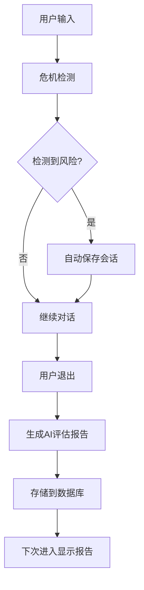

# 🚀 风险评估系统部署指南

## 系统概述

您已成功实现了完整的**自动风险评估报告系统**！这个系统可以：

### ✨ 核心功能
- **自动危机检测**: AI实时分析用户聊天内容，检测心理风险
- **智能会话保存**: 检测到风险后自动保存会话，无需手动操作
- **专业报告生成**: 退出聊天时自动分析并生成心理状态评估报告
- **历史追踪**: 记录心理状态变化趋势，支持长期健康监控
- **弹窗提醒**: 重新进入聊天时显示上次评估结果

## 📁 实现组件

### 后端实现 ✅
```
backend/
├── app/models/risk_assessment_report.py     # 数据库模型
├── app/services/risk_assessment_service.py  # 核心业务逻辑
├── app/api/routes/risk_assessment.py        # API接口
└── scripts/
    ├── migrate_risk_assessment.py           # 数据库迁移脚本
    └── simple_risk_test.py                 # 集成测试脚本
```

### 前端实现 ✅
```
frontend/src/
├── utils/chatMixin_enhanced.js              # 增强聊天功能
├── pages/risk-report/
│   ├── report-detail.vue                   # 报告详情页
│   └── report-history.vue                  # 历史记录页
└── pages.json                              # 路由配置已更新
```

## 🔧 部署步骤

### 1. 数据库迁移
```bash
# 在 backend 目录下运行
cd backend
python scripts/migrate_risk_assessment.py
```

### 2. 重启后端服务
```bash
# 停止当前服务 (Ctrl+C)
# 重新启动
uvicorn app.main:app --reload --host 0.0.0.0 --port 8000
```

### 3. 验证API端点
访问: http://localhost:8000/docs
查找以下新增端点：
- `POST /risk-assessment/generate-report` - 生成风险评估报告
- `GET /risk-assessment/latest-report/{session_id}` - 获取最新报告
- `PUT /risk-assessment/mark-viewed` - 标记报告已查看
- `GET /risk-assessment/reports-history` - 获取历史报告

## 🎯 使用流程

### 用户体验流程：
1. **开始聊天** → 用户进入聊天页面
2. **输入内容** → AI实时分析，检测风险关键词
3. **触发保存** → 检测到风险后自动保存会话
4. **退出聊天** → 自动生成心理状态评估报告
5. **重新进入** → 弹窗显示上次评估结果
6. **查看历史** → 可查看所有历史报告和趋势

### 技术实现流程：


## 🛡️ 安全特性

- **数据加密**: 聊天记录自动加密存储
- **隐私保护**: 报告仅用户本人可见
- **专业分析**: AI提供专业心理健康建议
- **危机干预**: 高风险情况提供紧急联系方式

## 📊 报告内容

每份风险评估报告包含：
- **风险等级**: 低/中等/较高/高危
- **风险分数**: 0-100分量化评估
- **AI分析**: 专业心理健康分析
- **检测关键词**: 风险相关词汇
- **专业建议**: 个性化改善建议
- **统计信息**: 消息数量、风险消息统计
- **时间追踪**: 对话和报告生成时间

## 🔄 后续优化建议

1. **数据分析**: 添加趋势图表显示
2. **通知系统**: 重要报告邮件/短信提醒
3. **专家对接**: 高风险用户专业心理师介入
4. **群体分析**: 匿名化数据用于改进AI模型
5. **移动优化**: 提升移动端用户体验

## 💡 故障排除

### 常见问题：
1. **API无法访问**: 检查后端服务是否正常运行
2. **数据库错误**: 确认迁移脚本执行成功
3. **前端页面空白**: 检查路由配置和权限
4. **AI分析失败**: 验证AI服务配置和API密钥

### 调试命令：
```bash
# 测试系统集成
python scripts/simple_risk_test.py

# 检查数据库连接
python -c "from app.database.session import get_db; print('数据库连接正常')"

# 验证模型导入
python -c "from app.models.risk_assessment_report import RiskAssessmentReport; print('模型导入成功')"
```

## 🎉 恭喜！

您已经成功实现了一个完整的AI驱动心理健康监控系统！这个系统将为用户提供：

- 🤖 **智能化**: AI自动分析和报告生成
- 🔄 **自动化**: 无需手动操作的流畅体验  
- 📈 **专业化**: 基于心理学的科学评估
- 🛡️ **安全化**: 数据加密和隐私保护

现在您可以开始测试完整的用户流程了！
