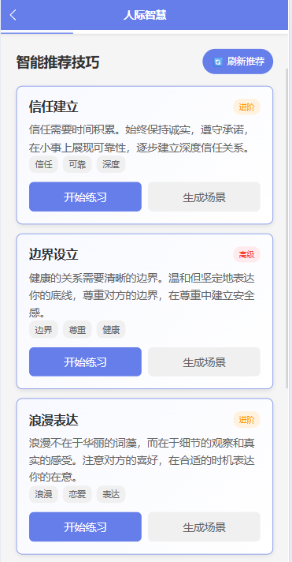
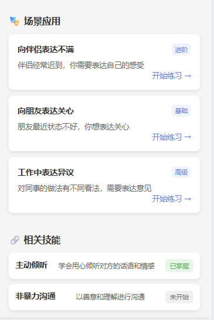

# ariadne 念念有声 TODO

## AI 对话模块

> 当前就 AI 聊天上大致功能已经实现且集成了一个简易的心理预警系统，后续心理预警系统可能需要改改

- ~~UI 优化~~
- ~~用户聊天内容加密与解密（做了但是没有应用上貌似是）~~

## 人际智慧模块

> 现在已经集成了较多的功能，所以 bug 也会很多，请在写代码的时候也顺便试试还有哪些没有做到的，在下面进行补充

- ~~点击开始练习时跳转有误，没有进入对应的界面，而是进入了统一的界面，可以考虑两种方案：（1）**开始练习**为自主设定对话情景，AI 根据选定的技巧来进行对话；**生成场景**为 AI 主导生成具体的环境，引导使用者进行对话。（2）将两个按钮的功能合二为一，进入页面后选择 AI 的一些配置后，比如性格、性别、年龄、阅历，然后 AI 根据已有信息来生成自己的身份来设置情景进行会话。~~
  
- ~~这个开始练习和相关技能的跳转逻辑也有点问题，包括继续学习和 AI 生成情景都进入同一个画面中，这是不合理的，可以参考主技能界面，也就是上一点的那个跳转逻辑进行修改~~
- 然后就是多少多少人已经学习了，每个人学多少了，那个进度需要根据数据库来进行修改之类的，可以看看数据库需不需要做什么修改
  
- ~~关系健康评估界面可以修改一下 UI，然后是引入更加复杂的评测表格之类的，比如那个测人格的~~
- ~~防护指南的情景识别训练功能依然有问题，经常性卡死（考虑移除，因为实战练习里面有一个几乎一模一样的）~~
- 应急资源部分有待完成
- 成长档案一栏有待思考如何处理
